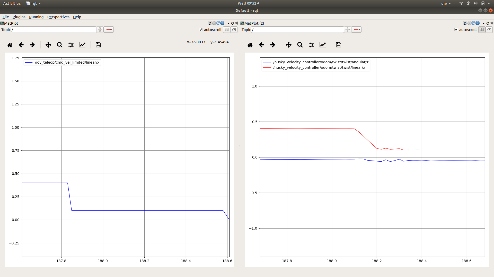

# cmd_vel_limiter

ROS package for limiting cmd_vel given thresholded distance from a laser scan.

## Topics

Input
 - `scan` - the LaserScan topic to listen to to compare to a distance threshold
 - `cmd_vel` - the Twist topic to limit
Output:
 - `cmd_vel_limited`- the Twist topic with the limit applied

## Parameters

 - `distance_threshold` - The distance threshold to apply to the laser scan, default 1m.
 - `max_x_vel` - The max x velocity to be allowed under the threshold, default 0.1 m/s.
 - `limit_in_reverse` - Whether the limit should be applied to negative x velocities, default false.

 # Notes

 The threshold is checked at the rate the laser topic publishes at. This is likely to yield frequent changes in threshold application when noise is present near the threshold value. The simplest approach to deal with this is to use [topic_tools](https://wiki.ros.org/topic_tools) to create a throttled version of the laser topic, and use that in place of the `scan` input (via topic remapping).

# Demo for Husky 

If you are testing this with the default Husky launch files, the command velocity from teleop is sent to `/joy_teleop/cmd_vel` where it is read by a command multiplexor. I struggled a little to get the topics to line up using topic remapping, therefore I had to clone `husky_control` into my workspace and edit the config file for the multiplexor (`rosed husky_control twist_mux.yaml`) to replace `  topic   : joy_teleop/cmd_vel` with   `topic   : joy_teleop/cmd_vel_limited`. This makes the mutliplexor igore the original topic and listen to the limited one instead.

With this in place the limiter can run with the following command:

`ROS_NAMESPACE=/joy_teleop rosrun cmd_vel_limiter laser_threshold scan:=/scan`

Note I push the node into the `joy_teleop` so that the command vel topics line up, but this requires that the relative topic name `scan` be made absolute.

To test that this is working, use `rqt` with a `Plot` visualisation plugin subscribing to `/joy_teleop/cmd_vel_limited/linear/x`. If you drive towards a wall you should see the x value drop to the limited value. If you want to see the commands sent to the robot you can add a second plot for `/husky_velocity_controller/odom/twist/twist/linear/x`.

